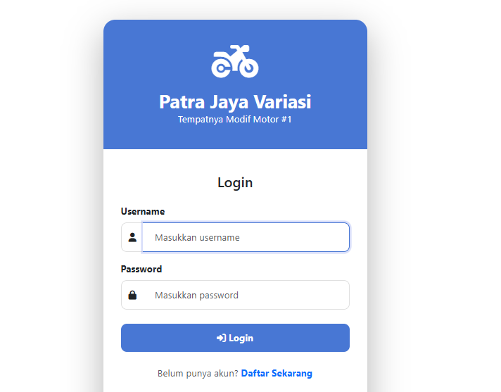
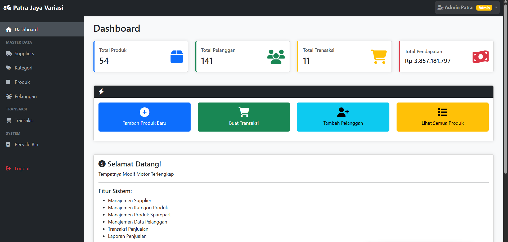
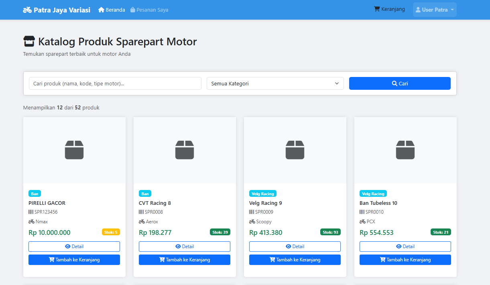
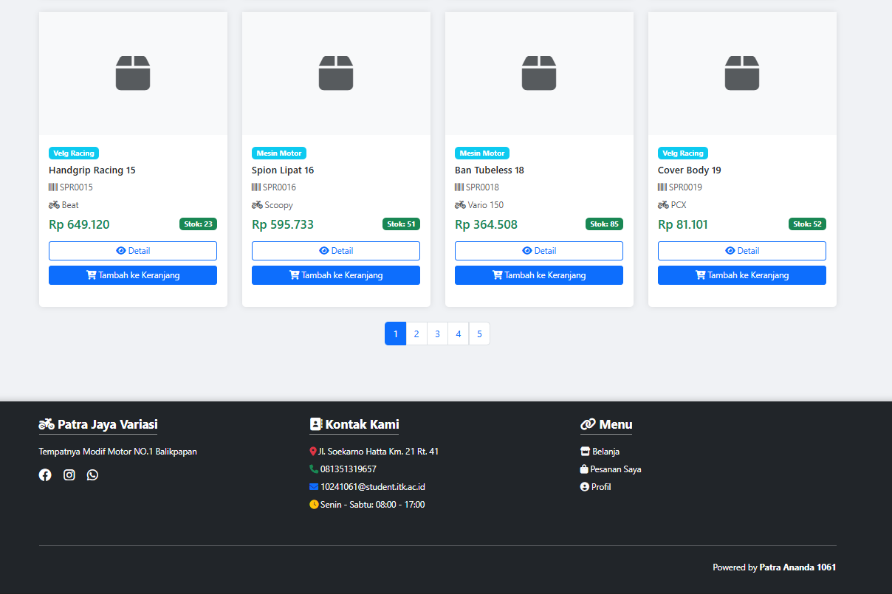

## Authentication & Authorzation Role-Based Access Control (RBAC)
### Week 8 

-----

NAMA : PATRA ANANDA     
NIM  : 10241061 

---

### TUGAS 
Buat Halaman Autentikasi,
berupa login page, dimana
terdapat pemisahan role (3
role berbeda)

----
### JAWABAN : 

### 1. Login Page (login.php)



**Login.php :**

```php
<form method="POST" action="login.php">
    <?= Csrf::field() ?>
    
    <div class="mb-3">
        <label class="form-label fw-bold">Username</label>
        <div class="input-group">
            <input type="text" name="username" id="username" ...>
        </div>
    </div>
    
    <div class="mb-4">
        <label class="form-label fw-bold">Password</label>
        <div class="input-group">
            <input type="password" name="password" id="password" ...>
        </div>
    </div>
    
    <button type="submit" class="btn btn-login">
        <i class="fas fa-sign-in-alt"></i> Login
    </button>
</form>

<div class="demo-accounts">
    <h6><i class="fas fa-key"></i> Akun Demo</h6>
    <p class="text-muted small mb-3">Klik untuk mengisi otomatis (Password: <strong>password</strong>)</p>
    
    <div class="demo-account developer" onclick="fillLogin('developer', 'password')">
        <strong><i class="fas fa-code"></i> Developer</strong>
        <small>Full access - Manage system, users, settings</small>
    </div>
    
    <div class="demo-account admin" onclick="fillLogin('admin', 'password')">
        <strong><i class="fas fa-user-shield"></i> Admin</strong>
        <small>Manage products, categories, suppliers, transactions</small>
    </div>
    
    <div class="demo-account user" onclick="fillLogin('user', 'password')">
        <strong><i class="fas fa-shopping-cart"></i> User</strong>
        <small>View products & create transactions</small>
    </div>
</div>
```

-----
**STYLE CSS:**
```css
body {
            background: linear-gradient(135deg, #ffffffff 0%rgba(255, 255, 255, 1)29 100%);
            min-height: 100vh;
            display: flex;
            align-items: center;
            justify-content: center;
            padding: 20px;
        }
        .login-container {
            max-width: 450px;
            width: 100%;
        }
            .login-card {
            background: white;
            border-radius: 20px;
            box-shadow: 0 20px 60px rgba(0,0,0,0.3);
            overflow: hidden;
        }
        .login-header {
            background: linear-gradient(135deg, #4877d4ff 0%, #4877d4ff 100%);
            color: white;
            padding: 40px 30px;
            text-align: center;
        }
        .login-header i {
            font-size: 4rem;
            margin-bottom: 15px;
        }
        .login-header h2 {
            margin: 0;
            font-weight: bold;
        }
        .login-body {
            padding: 40px 30px;
        }
        .form-control {
            padding: 12px 20px;
            border-radius: 10px;
            border: 2px solid #e0e0e0;
            transition: all 0.3s;
        }
        .form-control:focus {
            border-color: #4877d4ff;
            box-shadow: 0 0 0 0.2rem rgba(102, 126, 234, 0.25);
        }
        .btn-login {
            background: linear-gradient(135deg, #4877d4ff 0%, #4877d4ff 100%);
            color: white;
            padding: 12px;
            border-radius: 10px;
            font-weight: bold;
            border: none;
            width: 100%;
            transition: transform 0.3s;
        }
        .btn-login:hover {
            transform: translateY(-2px);
            box-shadow: 0 10px 20px rgba(0,0,0,0.2);
            color: white;
        }
        .input-group-text {
            border: 2px solid #e0e0e0;
            border-right: none;
            background: white;
            border-radius: 10px 0 0 10px;
        }
        .form-control.with-icon {
            border-left: none;
            border-radius: 0 10px 10px 0;
        }
        .demo-accounts {
            background: #f8f9fa;
            padding: 20px;
            border-radius: 10px;
            margin-top: 20px;
        }
        .demo-accounts h6 {
            color: #344aaaff;
            font-weight: bold;
            margin-bottom: 15px;
        }
        .demo-account {
            background: white;
            padding: 10px 15px;
            border-radius: 8px;
            margin-bottom: 10px;
            border-left: 4px solid;
            cursor: pointer;
            transition: all 0.3s;
        }
        .demo-account:hover {
            transform: translateX(5px);
            box-shadow: 0 2px 8px rgba(0,0,0,0.1);
        }
        .demo-account.developer { border-left-color: #dc3545; }
        .demo-account.admin { border-left-color: #ffc107; }
        .demo-account.user { border-left-color: #198754; }
        .demo-account small {
            display: block;
            color: #6c757d;
            margin-top: 3px;
        }
        .clear-session-link {
            position: fixed;
            bottom: 20px;
            right: 20px;
            background: #dc3545;
            color: white;
            padding: 10px 20px;
            border-radius: 50px;
            text-decoration: none;
            font-size: 0.85rem;
            box-shadow: 0 4px 12px rgba(0,0,0,0.3);
            transition: all 0.3s;
        }
        .clear-session-link:hover {
            background: #bb2d3b;
            color: white;
            transform: scale(1.05);
        }
```


### 2. Role Developer


---

**Data SQL :**
```SQL
-- Potongan dari motor_modif_shop.sql

-- 1. Mendefinisikan 'developer' sebagai salah satu pilihan di kolom `role`
CREATE TABLE IF NOT EXISTS `users` (
  /* ...kolom lain... */
  `role` enum('developer','admin','user') NOT NULL DEFAULT 'user',
  /* ...kolom lain... */
);

-- 2. Membuat akun default untuk Developer
INSERT INTO `users` (`username`, `password`, `email`, `full_name`, `role`) VALUES
('developer', '$2y$10$92IXUNpkjO0rOQ5byMi.Ye4oKoEa3Ro9llC/.og/at2.uheWG/igi', 'developer@patra.com', 'Developer Patra', 'developer'),
('admin', '... (password admin) ...', 'admin@patra.com', 'Admin Patra', 'admin'),
('user', '... (password user) ...', 'user@patra.com', 'User Patra', 'user');
```

---
**login.php :**
```html
<div class="demo-accounts">
    <h6><i class="fas fa-key"></i> Akun Demo</h6>
    
    <div class="demo-account developer" onclick="fillLogin('developer', 'password')">
        <strong><i class="fas fa-code"></i> Developer</strong>
        <small>Full access - Manage system, users, settings</small>
    </div>
    
    <div class="demo-account admin" onclick="fillLogin('admin', 'password')">
        <strong><i class="fas fa-user-shield"></i> Admin</strong>
        <small>Manage products, categories, suppliers, transactions</small>
    </div>
    
    <div class="demo-account user" onclick="fillLogin('user', 'password')">
        <strong><i class="fas fa-shopping-cart"></i> User</strong>
        <small>View products & create transactions</small>
    </div>
</div>
```

**style.css :**
```css
/* Potongan dari <style> di login.php */

.demo-account {
    /* ... style dasar ... */
    border-left: 4px solid; /* Garis di kiri */
    cursor: pointer;
}

/* Style khusus yang menargetkan class .developer */
.demo-account.developer { 
    border-left-color: #dc3545; /* Memberi warna merah */
}

.demo-account.admin { border-left-color: #ffc107; } /* Kuning */
.demo-account.user { border-left-color: #198754; }  /* Hijau */

```

----

**Auth.php :** 

```php
// Potongan dari motor_modif_shop/helpers/Auth.php

class Auth {
    // ... (fungsi login, logout, check, dll) ...

    /**
     * Get current user role
     */
    public static function role() {
        return $_SESSION['role'] ?? null;
    }
    
    /**
     * Check if user is developer
     * Ini adalah fungsi utamanya
     */
    public static function isDeveloper() {
        // Mengecek apakah 'role' di session adalah 'developer'
        return self::role() === 'developer';
    }
    
    /**
     * Check if user is admin
     */
    public static function isAdmin() {
        return self::role() === 'admin';
    }
    
    /**
     * Check if user is regular user
     */
    public static function isUser() {
        return self::role() === 'user';
    }
}
```
----

**Routing utama index.php :**

```php

$accessRules = [
    // Dashboard - semua role bisa akses
    'dashboard' => ['developer', 'admin', 'user'],
    
    // Shop - HANYA USER
    'shop' => ['user'],
    
    // Admin & Developer
    'products' => ['developer', 'admin'],
    'categories' => ['developer', 'admin'],
    'suppliers' => ['developer', 'admin'],
    'customers' => ['developer', 'admin'],
    'transactions' => ['developer', 'admin'],
    'recyclebin' => ['developer', 'admin'],
    
    // User Transactions - HANYA USER
    'mytransactions' => ['user'],
    'checkout' => ['user'],
    'profile' => ['user'],
    
    // Users Management - HANYA DEVELOPER
    'users' => ['developer'],
    
    // Settings - HANYA DEVELOPER
    'settings' => ['developer']
];


$hasAccess = false;
$currentRole = Auth::role(); // Mengambil role dari session (misal: 'developer')

// ... (logika pengecekan dashboard) ...

// Check controller access
if (isset($accessRules[$controller])) {
    // Mengambil daftar role yang diizinkan untuk controller ini
    // Contoh: jika $controller = 'users', $allowedRoles akan berisi ['developer']
    $allowedRoles = $accessRules[$controller]; 
    
    // Mengecek apakah role pengguna saat ini ada di dalam daftar yang diizinkan
    if (in_array($currentRole, $allowedRoles)) {
        $hasAccess = true;
    }
}

// DENY ACCESS if user doesn't have permission
if (!$hasAccess) {
    // Jika Role 'admin' mencoba akses 'users', $hasAccess akan false
    // Pengguna akan ditolak dan dilempar kembali ke dashboard
    setFlash('danger', '❌ Anda tidak memiliki akses ke halaman ini. Role Anda: <strong>' . $currentRole . '</strong>');
    redirect('index.php');
    exit;
}
```

---

### 3. Role Admin 


**Data SQL :**

```sql
-- Potongan dari motor_modif_shop.sql

-- 1. Mendefinisikan 'admin' sebagai salah satu pilihan di kolom `role`
CREATE TABLE IF NOT EXISTS `users` (
  /* ... */
  `role` enum('developer','admin','user') NOT NULL DEFAULT 'user',
  /* ... */
);

-- 2. Membuat akun default untuk Admin
INSERT INTO `users` (`username`, `password`, `email`, `full_name`, `role`) VALUES
('developer', '... (password developer) ...', 'developer@patra.com', 'Developer Patra', 'developer'),
('admin', '$2y$10$92IXUNpkjO0rOQ5byMi.Ye4oKoEa3Ro9llC/.og/at2.uheWG/igi', 'admin@patra.com', 'Admin Patra', 'admin'),
('user', '... (password user) ...', 'user@patra.com', 'User Patra', 'user');
```
**Login.php Admin :**
```php
<div class="demo-accounts">
    <h6><i class="fas fa-key"></i> Akun Demo</h6>
    
    <div class="demo-account admin" onclick="fillLogin('admin', 'password')">
        <strong><i class="fas fa-user-shield"></i> Admin</strong>
        <small>Manage products, categories, suppliers, transactions</small>
    </div>

    </div>
```

**style css :**
```css
/* Potongan dari <style> di login.php */

/* Style khusus yang menargetkan class .admin */
.demo-account.admin { 
    border-left-color: #ffc107; /* Memberi warna kuning */
}
```

**Auth.php :**

```php
// Potongan dari motor_modif_shop/helpers/Auth.php

class Auth {
    // ...

    /**
     * Check if user is admin
     * Fungsi ini mengecek apakah role di session adalah 'admin'
     */
    public static function isAdmin() {
        return self::role() === 'admin';
    }
    
    // ...
}
```

**Login.PHP : Admin Role**
```php
// Potongan dari index.php

$accessRules = [
    // Dashboard - semua role bisa akses
    'dashboard' => ['developer', 'admin', 'user'],
    
    // Shop - HANYA USER
    'shop' => ['user'],
    
    // ==========================================
    // INI BAGIAN KHUSUS ADMIN (& DEVELOPER)
    // ==========================================
    'products' => ['developer', 'admin'],
    'categories' => ['developer', 'admin'],
    'suppliers' => ['developer', 'admin'],
    'customers' => ['developer', 'admin'],
    'transactions' => ['developer', 'admin'],
    'recyclebin' => ['developer', 'admin'],
    
    // ==========================================
    // INI BAGIAN YANG TIDAK BISA DIAKSES ADMIN
    // ==========================================
    'users' => ['developer'],
    'settings' => ['developer']
];

// ... (Logika Pengecekan Akses) ...
// Jika 'admin' mencoba mengakses ?c=users, 
// 'admin' tidak ada di $allowedRoles (['developer']),
// sehingga $hasAccess = false dan akan di-redirect.
```


### 4. User / pembeli 




**login.php :**
```php
<div class="demo-accounts">
    <div class="demo-account user" onclick="fillLogin('user', 'password')">
        <strong><i class="fas fa-shopping-cart"></i> User</strong>
        <small>View products & create transactions</small>
    </div>
</div>
```

**style css :**
```css
/* Potongan dari <style> di login.php */

/* Style khusus yang menargetkan class .user */
.demo-account.user { 
    border-left-color: #198754; /* Memberi warna hijau */
}
```

**Auth.php :**
```php
// Potongan dari motor_modif_shop/helpers/Auth.php

class Auth {
    // ...

    /**
     * Check if user is regular user
     * Fungsi ini mengecek apakah role di session adalah 'user'
     */
    public static function isUser() {
        return self::role() === 'user';
    }

    /**
     * Register new user
     */
    public static function register($data) {
        // ... (Logika validasi data) ...

        // Check if username exists
        // ... (Logika cek username) ...
        
        // Hash password
        $hashedPassword = password_hash($data['password'], PASSWORD_DEFAULT);
        
        // Insert user
        // Perhatikan bahwa role 'user' di-hardcode di sini
        $sql = "INSERT INTO users (username, password, email, full_name, role) VALUES (?, ?, ?, ?, 'user')";
        $stmt = self::$db->prepare($sql);
        $stmt->bind_param('ssss', 
            $data['username'],
            $hashedPassword,
            $data['email'],
            $data['full_name']
        );
        
        if ($stmt->execute()) {
            return ['success' => true, 'message' => 'Registrasi berhasil! Silakan login.'];
        }
        // ...
    }
}
```

**register.php :**
```php
// Potongan dari register.php

// Handle registration
if ($_SERVER['REQUEST_METHOD'] === 'POST') {
    // ... (Mengambil data POST) ...

    // Memanggil fungsi register, yang otomatis membuat 'user'
    $result = Auth::register($data);
    
    if ($result['success']) {
        setFlash('success', $result['message']);
        redirect('login.php');
    } else {
        // ... (Handle error) ...
    }
}
```

**Role index.php :**
```php
// Potongan dari index.php

$accessRules = [
    // Dashboard - semua role bisa akses
    'dashboard' => ['developer', 'admin', 'user'],
    
    // ==========================================
    // INI BAGIAN KHUSUS USER (PEMBELI)
    // ==========================================
    'shop' => ['user'],
    'mytransactions' => ['user'],
    'checkout' => ['user'],
    'profile' => ['user'],
    
    // ==========================================
    // INI BAGIAN YANG DIBLOKIR UNTUK USER
    // ==========================================
    'products' => ['developer', 'admin'],
    'categories' => ['developer', 'admin'],
    'suppliers' => ['developer', 'admin'],
    'customers' => ['developer', 'admin'],
    'transactions' => ['developer', 'admin'],
    'recyclebin' => ['developer', 'admin'],
    'users' => ['developer'],
    'settings' => ['developer']
];

// ... (Pengecekan akses $hasAccess) ...

// ========================================
// DASHBOARD ROUTING - FIXED
// ========================================

if ($controller == 'dashboard' || $controller == '') {
    
    // INI KUNCINYA:
    // Jika yang login adalah 'user' (Auth::isUser() == true)
    if (Auth::isUser()) {
        // Jangan tampilkan dashboard admin,
        // tapi langsung LEMPAR (redirect) ke halaman toko
        if (!isset($_GET['c']) || $_GET['c'] !== 'shop') {
            header('Location: index.php?c=shop&a=index');
            exit;
        }
    }
    
    // ADMIN & DEVELOPER: Show admin dashboard
    if (Auth::isAdmin() || Auth::isDeveloper()) {
        // ... (Kode untuk menampilkan dashboard admin) ...
    }
}
```