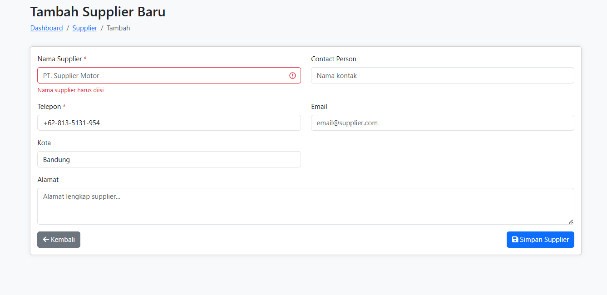
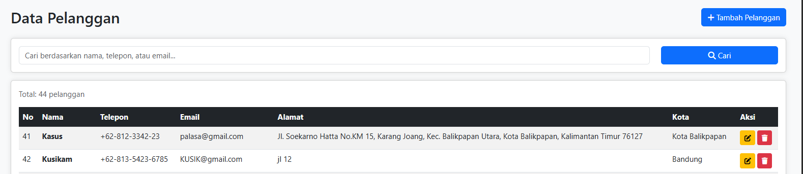
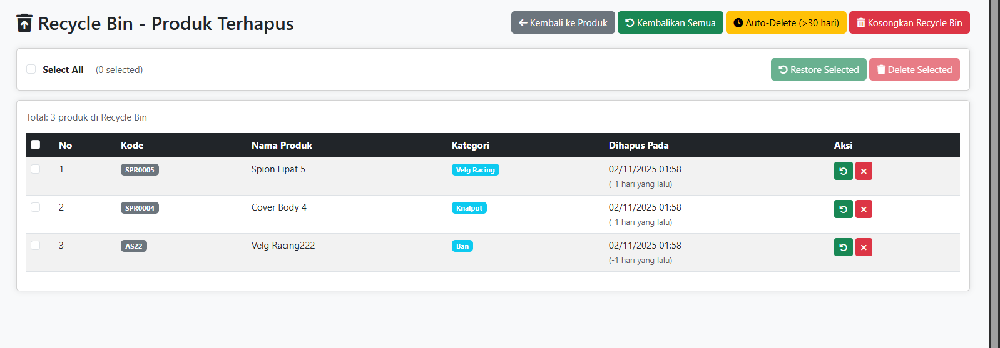
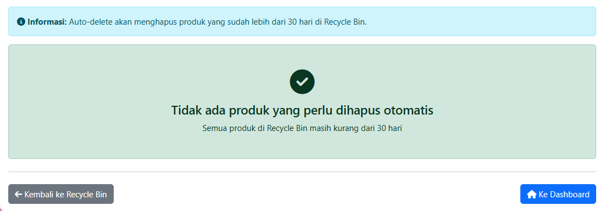
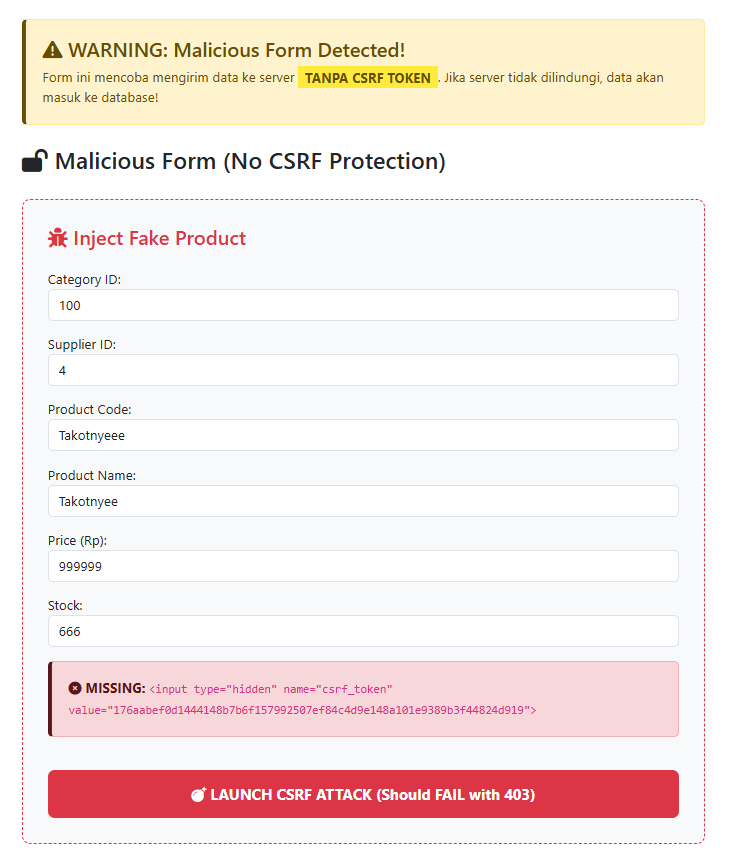
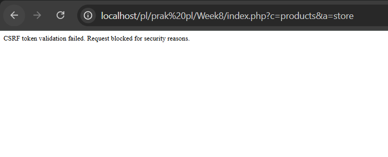
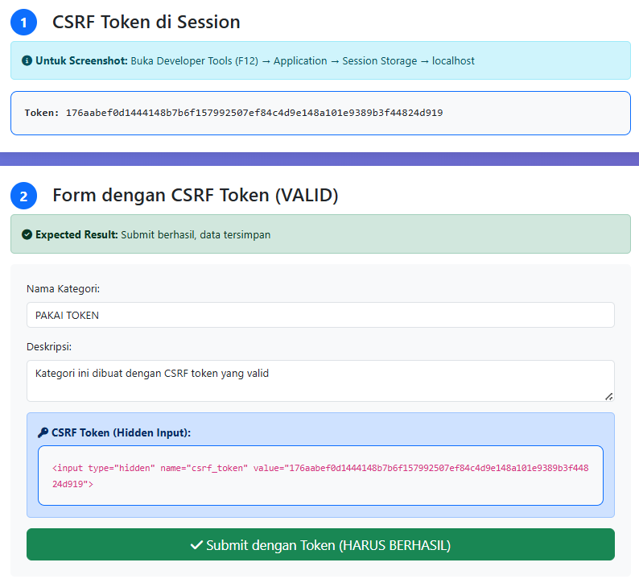
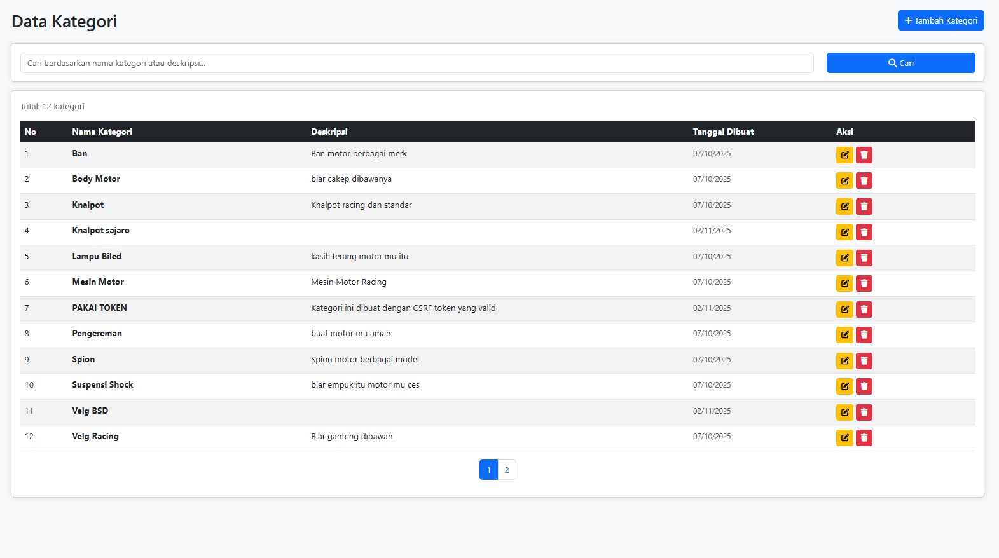

### Week 7 - Praktikum Pemrograman Lanjut A
 
NAMA : Patra Ananda   
NIM  : 10241061


-----

## SOAL : 


----
### JAWAB : 

### 1. Harus mengunakan Kata kata untuk nama supplier, tidak boleh menggunakan simbol
 

-----

### 2. Helper Classes phone($Value) Format +62 XXX XXX XXX


----
### 3. Auto-Delete dan Bulk Restore 


----
### 4. Hard delete > 30 hari 


----
### 5. Csrf-test.php 
   

----
### 6. Isi data tanpa Token akan ditolak diluar website Csrf-test.php


----
### 7. Isi data dengan menggunakan Token


-----
## 8. Dan hasilnya bisa dimasukan karena dapat token dari dalam website


---
## Implementasi Pada Project Motor Variasi


-----

## 1. Builder Pattern – Validator Class

### Tujuan di Website
Membuat sistem validasi form yang bisa disusun secara berantai (chainable), supaya mudah dibaca dan bisa digunakan di banyak form (produk, pelanggan, supplier, dll).

### Sebelum Builder Pattern
```php
if (empty($_POST['price'])) {
    $errors[] = 'Harga wajib diisi';
}
if (!is_numeric($_POST['price'])) {
    $errors[] = 'Harga harus berupa angka';
}
if ($_POST['price'] < 1000 || $_POST['price'] > 10000000) {
    $errors[] = 'Harga di luar batas yang diperbolehkan';
}
```

### Sesudah Builder Pattern
```php
$validator->field('price')
          ->required()
          ->numeric()
          ->between(1000, 10000000);
```

### Efek di Website
- Form validasi di semua halaman jadi seragam.
- Developer tinggal “membangun” aturan seperti berbicara.
- Gampang tambah aturan baru (misalnya `unique()` atau `confirmed()`).

---

## 2. Factory Pattern – ProductFactory & CustomerFactory

### Tujuan di Website
Menyederhanakan proses insert data produk dan pelanggan tanpa menulis ulang SQL di setiap controller.

### Sebelum Pakai Factory
```php
$sql = "INSERT INTO products (name, price) VALUES (?, ?)";
$stmt = $db->prepare($sql);
$stmt->bind_param("si", $data['name'], $data['price']);
$stmt->execute();
```

### Setelah Pakai Factory
```php
$productFactory = new ProductFactory($db);
$productFactory->create([
    'name' => 'Vario 150 Spare Part',
    'price' => 250000,
    'supplier_id' => 3
]);
```

### Efek di Website
- Tambah produk baru cukup satu baris kode.
- Bisa generate data dummy untuk testing.
- Semua logika insert tersentralisasi, jadi lebih aman dan efisien.

---

## 3. Recycle Bin – Auto Delete dan Bulk Restore

### Tujuan di Website
Fitur Recycle Bin seperti “tempat sampah” di admin panel. Saat produk dihapus, data tidak langsung hilang, tapi diberi timestamp `deleted_at`.

### Auto Delete (>30 Hari)
```php
$products = $db->query("
    SELECT * FROM products
    WHERE deleted_at < DATE_SUB(NOW(), INTERVAL 30 DAY)
");
foreach ($products as $p) {
    if (!hasTransaction($p['id'])) {
        unlink("uploads/{$p['image']}");
        $db->query("DELETE FROM products WHERE id = {$p['id']}");
    }
}
```

### Bulk Restore
**Frontend (JavaScript):**
```javascript
let selected = [];
function toggleSelect(id) {
    if (selected.includes(id)) selected = selected.filter(x => x !== id);
    else selected.push(id);
}
```

**Backend (PHP):**
```php
$ids = array_map('intval', json_decode($_POST['ids']));
$sql = "UPDATE products SET deleted_at = NULL WHERE id IN (" . implode(',', $ids) . ")";
$db->query($sql);
```

### Efek di Website
- Admin bisa pilih banyak data sekaligus dan klik “Restore”.
- UI terasa modern (ada “Select All”, jumlah terpilih, dll).
- Menggunakan transaksi untuk keamanan data.

---

## 4. Helper Classes

### A. Sanitizer
```php
class Sanitizer {
    public static function phone($value) {
        $value = preg_replace('/[^0-9]/', '', $value);
        return '+62-' . substr($value, 1, 3) . '-' . substr($value, 4);
    }
    public static function name($value) {
        return ucwords(preg_replace('/[^a-zA-Z\s]/', '', $value));
    }
    public static function alphanumeric($value) {
        return preg_replace('/[^a-zA-Z0-9]/', '', $value);
    }
}
```

### B. DateHelper
```php
DateHelper::diffHuman('2024-10-15'); // Output: "18 hari yang lalu"
DateHelper::isWeekend('2024-11-02'); // Output: true
DateHelper::format('2024-11-02', 'd/m/Y'); // Output: "02/11/2024"
```

---

## 5. CSRF Protection

### Tujuan di Website
Untuk mencegah Cross-Site Request Forgery (form palsu dari luar situs).

**HTML View:**
```php
<form method="POST" action="save.php">
    <?= Csrf::field() ?>
    <input type="text" name="name">
    <button type="submit">Simpan</button>
</form>
```

**Controller:**
```php
public function store() {
    Csrf::verifyOrFail($_POST['csrf_token'] ?? '');
}
```

### Efek di Website
- Hanya form asli dari situs yang bisa dikirim.
- Form palsu dari situs luar ditolak (403 Forbidden).
- Semua form admin jadi lebih aman.

---

## Kesimpulan

| Fitur | Dampak di Website |
|-------|--------------------|
| Builder Pattern | Validasi form jadi rapi dan reusable |
| Factory Pattern | Insert data lebih mudah & aman |
| Recycle Bin | Data bisa dipulihkan, tidak langsung hilang |
| Helper Classes | Input & tanggal lebih bersih dan otomatis |
| CSRF Protection | Form 100% aman dari serangan eksternal |

---

emua pattern ini membuat website lebih cepat dikembangkan, aman, dan mudah di-maintain.


